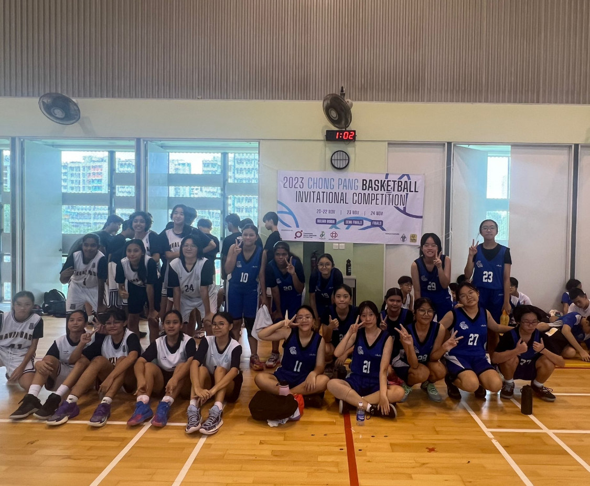

# Simonne Maia's Portfolio!

## About Me
As a dedicated student at Jurong West Secondary School, I am deeply passionate about programming and problem-solving, aspiring to establish a career in the tech industry. My programming journey commenced at the age of 10, back in 2018, when I actively participated in a robotics enrichment program facilitated by NLB(National Library Board), where I delved into hands-on projects involving microbits and other small robots. This immersive and engaging experience sparked a profound interest in coding, prompting me to continuously seek avenues to enhance my proficiency. Python stands as my programming language of choice, and for the past 2 years, I have been dedicated to weekly Python classes and ongoing project works. I also had the opportunity to participate in a robotics ApLM@SP. These endeavors have provided me with a solid foundation in Python coding and have equipped me with the capability to tackle complex challenges. I am dedicated to leveraging Python to create innovative solutions that positively impact society. My drive for learning and developing my hard and soft skills motivates me to push boundaries in programming, aiming to contribute meaningfully to the community through technology.
<!--  -->

 
        3rd Day, ApLM@SP

## Achievements
  - Medicine toss ball race 2022 **2nd place**
  - Long distance race 2022 **2nd place**
  - 400m race 2023 **1st place**
  - 200m race 2024 **3rd place**
  - 4x100m race 2023 **2nd place**
  - 4x100m race 2024 **2nd place**
  - Cross Country 2022 **14th place**
  - Cross Country 2023 & 2024 **Top 50 places**
  - Achieved [**Bronze Award**](https://drive.google.com/file/d/1OcKTJlJznoKAZzUy9EDZfL1MH2OJK7PW/view?usp=sharing) in HSI(Historical Scene Investigations) 2022
    

Me & my teammates recieving our medal for the 4x100 race
    
## Contributions
### School Participations
  - Actively **participated** in all yearly interclass games
  - **Gave a presentation/talk** to my school on environmental sustainability in 2024
  - Participated in my school's **student outreach** 2022 & 2023
  - **Usher** for primary school students and parents in my school's **Open house** 2022
  - Participated in Basketball CCA Open House 2023 & 2024
  - Helped out in Orientation Program 2024 Planning during Nov/Dec Holidays
  - **Participated** in class VIA 2021, 2022 & 2023

 
  student outreach!                              cca open house!

### External Competitions
  - Represented the school in **Ultimate Frisbee Under-17 competition 2024**
  - Represented the school in **HSI 2022**
  - Represented my school(Jwss Team2) in Sibbersec Cybersecurity CTF(Capture-The-Flag) 5.0 Competition
  
## Leadership
  - **Vice-chairperson** of 4Passion 2024
  - **Publicity head** of Jurong West basketball girls 2023 - 2024
  - **Facilitator** in secondary1 **Orientation Program** 2024
  - **Led the class 4Passion VIA** in 2024

With my secondary 1 class and my other fellow facilitators
        
## Achievements - (Computing related)
### Python Hackaton
  [Python Hackaton Certificate](https://drive.google.com/file/d/1-b5eZotzmOEvmzETqeIScOLkDwrRfrPe/view?usp=sharing) 
  - The Hackathon focuses on addressing challenges involving crucial programming concepts such as conditional statements, loops, lists, functions, list comprehension, dictionaries, as well as search and sorting algorithms. Participants are tasked with leveraging these fundamental topics to devise innovative solutions and showcase their problem-solving skills effectively.

### [Algorithmics](https://algorithmicschool.com/?utm_source=organic&utm_medium=google&utm_referrer=www.google.com) Python Course
#### Completed course Python Basic
  [Python Basic Certificate](https://drive.google.com/file/d/1gWsX14oeGTpsDikJf1COCE2zCOAJauXv/view?usp=sharing)
  - This course focused on Basics of programming, Variables, Conditional statements, Loops, Basic problem solving skills  
    
#### Completed course Python Intermediate
  [Python Intermediate Certificate](https://drive.google.com/file/d/1LkYJbEaQro1YePIobGfn-BOg5rDt-qVK/view?usp=sharing) 
  - This course focused on Lists, Functions, Modules, Search Algorithms, Intermediate problem solving skills  
    
#### Completed course Python Advanced
  [Python Advanced Certificate](https://drive.google.com/file/d/1hnp_qwMjHiMuPm7xXUBIUDp0grKaJLLz/view?usp=sharing) 
  - This course was more focused on algorithms like sorting and searching algorithms, input parsing and advanced techniques related to lists, functions   and dictionaries.
  
### Participated in [Sibbersec CTF 5.0](https://sieberr.live/) 
  [Sibbersec CTF Participation Certificate](https://drive.google.com/file/d/1uX7qo4AKpHAwtweZFqnpaUzgiLr09exg/view?usp=sharing)
  - Represented my school(Jwss Team2) in a Cybersecurity CTF(Capture-The-Flag) Competition 
  
### Participated in EduBlitz Program 2022
  [EduBlitz Participation Certificate](https://drive.google.com/file/d/1MyT-sAwUTp6ZnlIbayQSowoRMtWXn41Z/view?usp=sharing)
  - Participated in a robotics program that taught us to utilize microbits into real life problems.

## Projects 
### School Management Project
  [Github Link](https://github.com/SimonneMaia/School-Management-System.git) for project
  - I have developed software that can **read CSV files** containing information about students and courses, allowing for **data extraction and analysis**. The software offers a **range of features** including calculating the average grade for each course and student, determining the number of students, compiling a list of students who failed a specific course, converting numeric grades to letter grades, counting the occurrences and percentage of each letter grade for a given course, displaying comprehensive data for students based on their first and last names, and assessing the overall grade for students based on their first and last names. These functionalities streamline the process of extracting valuable insights from the data set and provide a robust platform for in-depth analysis and reporting.

## CCA - Basketball
- Participated in Cdiv NSG 2022, acheived Play Fair Award
- Participated in Bdiv NSG 2023
- Participated in Bdiv NSG 2024

- Participated in ChongPang Basketball invitational competition

   
